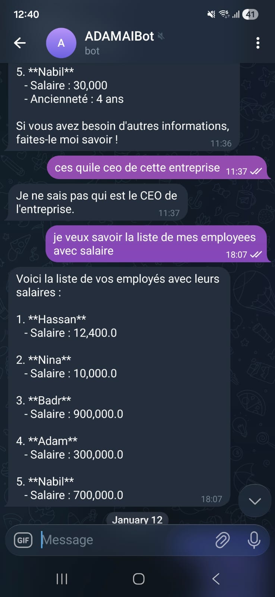

# ecom-chatbot

This project hosts a Spring-based e-commerce assistant with Telegram and web chat entry points. The bot answers questions about employees, salaries, and other company data while exposing a simple web UI layer.

## Preview



The screenshot above illustrates a sample interaction over Telegram, where the bot retrieves employee salary information.

## Project Structure

- `src/main/java/com/example/ecombot` – Main chatbot application (Spring Boot)
- `src/main/java/com/example/ecombot/agents` – AI agent logic
- `src/main/java/com/example/ecombot/telegram` – Telegram bot integration
- `src/main/java/com/example/ecombot/web` – REST endpoints / web controller
- `mcp-server/` – Supplementary MCP server component (Spring Boot)
- `README/` – Documentation and assets for project overview

## Local Setup

1. Ensure Java 17+ and Maven are installed.
2. Install dependencies and build:
   ```bash
   mvn clean package
   ```
3. Run the main application:
   ```bash
   mvn spring-boot:run
   ```
4. Configure Telegram bot token and other secrets via `src/main/resources/application.properties`.

## Contributing

1. Fork and clone the repository.
2. Create a feature branch:
   ```bash
   git checkout -b feature/your-feature
   ```
3. Commit changes and open a pull request.
